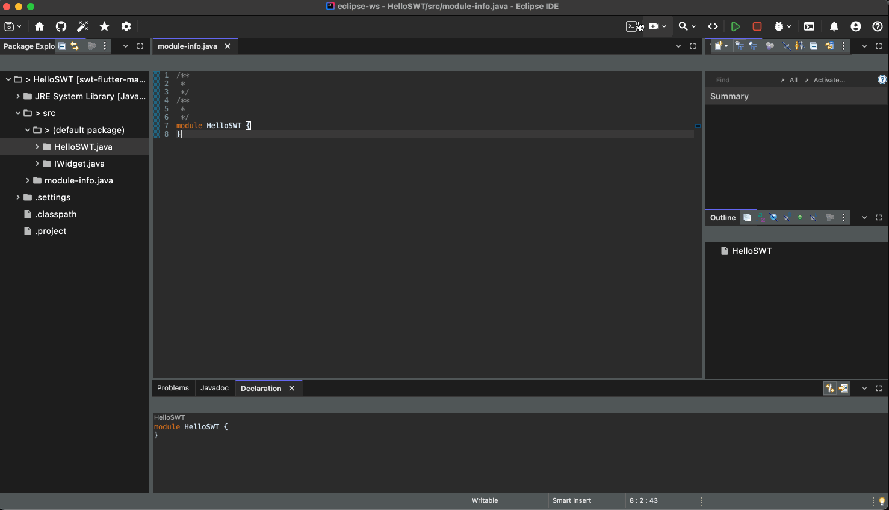

# SWT Evolve


  

[//]: # ([![GitHub stars]&#40;https://img.shields.io/github/stars/your-username/swt-evolve?style=social&#41;]&#40;https://github.com/equodev/swt-evolve/stargazers&#41;)

> **Modernize your SWT or Eclipse RCP application without changing a line of code. A new, cross-platform SWT library for desktop and web.**

SWT Evolve is a cross-platform drop-in replacement for the standard SWT library. It allows you to instantly upgrade your application's user interface to a modern, fluid, and beautiful standard, without rewriting your UI code.

---

## ✨ See it in Action

Words don't do it justice. Here is a standard Eclipse RCP application running with SWT Evolve.



### 🎨 SWT Evolve Widget Gallery

Check out the gallery of SWT snippets showing **SWT Evolve** implementations:  
👉 [**SWT Evolve Gallery**](https://equo.dev/swt-gallery)

This gallery provides small, focused SWT code snippets with rendered previews —  
a quick way to explore available widgets and see how they look in practice.

---

## 🚀 Getting Started: 2-Minute Modernization

You can try our examples or modernize your existing application in just a few minutes. Requirements: JDK 17+.

### Run the Examples

The easiest way to see SWT Evolve in action is to run the examples included in this repository.

1.  **Clone the repository:**
    ```bash
    git clone https://github.com/equodev/swt-evolve.git
    cd swt-evolve
    ```

2. **Run the examples you want:**
    ```bash
    ./gradlew runExample -PmainClass=dev.equo.StyledTextSnippet3
    ```
---

### Modernize Your Own App

**Recommended: Use the Equo CLI**

The easiest and recommended way to modernize an SWT or Eclipse RCP application is with the **Equo CLI**. It automatically detects and replaces the SWT JAR in your application, with support for folders, ZIP files, and DMG bundles.

See the **Equo CLI** section below for installation instructions, supported platforms, and usage examples.

**Manual JAR Replacement (Advanced)**

If you prefer not to use the CLI, you can manually replace the SWT JAR:

1.  **Get SWT Evolve:** Clone this repository and build it (see [CONTRIBUTING.md](./CONTRIBUTING.md)), or get the `swt-evolve.jar` file from:
    - [Download latest release](https://github.com/equodev/swt-evolve/releases/latest)
2.  **Locate Your Old SWT Jar:** Find the original `swt.jar` in your SWT application.
3.  **Replace and Run:** Rename the swt-evolve JAR to match the exact filename of the original SWT JAR you located. Then, use your renamed file to replace the original. That's it—run your application to see the modernized UI.
---

## 🛠️ Equo CLI

The Equo CLI lets you modernize any SWT, Eclipse RCP application instantly — no code changes required. Pass a folder, ZIP, or DMG and the CLI will automatically detect and replace the SWT JAR.

### Install via script

macOS / Linux:
```bash
curl -fsSL https://dl.equo.dev/evolve/cli/install.sh | bash && source ~/.equo/env
```

Windows (PowerShell):
```powershell
irm https://dl.equo.dev/evolve/cli/install.ps1 | iex
```

### Manual install

<details>
<summary>Windows (x86_64)</summary>

```powershell
curl.exe -fL -o equo-windows.zip https://dl.equo.dev/evolve/cli/equo-windows.zip
Expand-Archive equo-windows.zip .\equo -Force
.\equo\equo.exe --help
```
</details>

<details>
<summary>Windows (arm64)</summary>

```powershell
curl.exe -fL -o equo-windows-arm64.zip https://dl.equo.dev/evolve/cli/equo-windows-arm64.zip
Expand-Archive equo-windows-arm64.zip .\equo -Force
.\equo\equo.exe --help
```
</details>

<details>
<summary>macOS (Apple Silicon)</summary>

```bash
curl -fL -o equo-macos-arm64.zip https://dl.equo.dev/evolve/cli/equo-macos-arm64.zip
unzip equo-macos-arm64.zip -d equo
./equo/equo --help
```
</details>

<details>
<summary>macOS (Intel)</summary>

```bash
curl -fL -o equo-macos-amd64.zip https://dl.equo.dev/evolve/cli/equo-macos-amd64.zip
unzip equo-macos-amd64.zip -d equo
./equo/equo --help
```
</details>

<details>
<summary>Linux (x86_64)</summary>

```bash
curl -fL -o equo-linux.zip https://dl.equo.dev/evolve/cli/equo-linux.zip
unzip equo-linux.zip -d equo
./equo/equo --help
```
</details>

<details>
<summary>Linux (arm64)</summary>

```bash
curl -fL -o equo-linux-arm64.zip https://dl.equo.dev/evolve/cli/equo-linux-arm64.zip
unzip equo-linux-arm64.zip -d equo
./equo/equo --help
```
</details>

### Usage

```bash
# Modernize an SWT application (desktop)
equo modernize path/to/your/app

# Modernize for web — run your SWT application directly in a browser
equo modernize --web path/to/your/app
```

You can pass a folder, a ZIP file, or a DMG. Run `equo modernize --help` to see all available options and examples.

---

## 🏆 NatTable Example Application

[NatTable](https://www.eclipse.org/nattable/) is one of the most advanced and widely-used SWT-based grid components. We ship a ready-to-run NatTable example application modernized with SWT Evolve (web), so you can immediately see it running in your browser.

### Download

| Platform | Download |
|---|---|
| Linux (x86_64) | [nattable.example.e4-linux-x86_64.zip](https://dl.equo.dev/swt/nattable.example/nattable.example.e4-linux-x86_64.zip) |
| macOS (Apple Silicon) | [nattable.example.e4-macos-aarch64.zip](https://dl.equo.dev/swt/nattable.example/nattable.example.e4-macos-aarch64.zip) |
| macOS (Intel) | [nattable.example.e4-macos-x86_64.zip](https://dl.equo.dev/swt/nattable.example/nattable.example.e4-macos-x86_64.zip) |
| Windows (x86_64) | [nattable.example.e4-win-x86_64.zip](https://dl.equo.dev/swt/nattable.example/nattable.example.e4-win-x86_64.zip) |

---

## Key Features

* **✨ Instant Modernization:** No need for costly rewrites or code changes. If it runs on SWT, it runs on SWT Evolve.
* **💻 Truly Cross-Platform:** Develop once and deploy your application on Windows, macOS, Linux, and **in a web browser** from the same codebase.
* **🚀 GPU-Accelerated Performance:** Powered by a modern rendering engine, UIs are fluid, responsive, and efficient.
* **✒️ Pixel-Perfect Rendering:** Clean fonts, sharp icons, and beautiful widgets bring your application into the modern era.
* **🤝 100% API Compatible:** We are committed to implementing the complete SWT API for a seamless transition.
* **🔄 Seamless Fallback for Gradual Modernization:** Adopt at your own pace. SWT Evolve intelligently renders our modernized widgets and automatically falls back to the original SWT library for any widget we haven't implemented yet. Your application remains 100% functional, always.

---

## 📊 Project Status: Alpha

SWT Evolve is currently in an **alpha** stage. While we continue refining the implementation and improving performance, all standard SWT widgets are now implemented and we are already working with customers on commercial prototypes.
---

## 🗺️ Roadmap

Our primary mission is the drive towards a stable `1.0` release. The vision for 1.0 is to provide a complete, modern, and high-performance replacement for the standard SWT library. **We are aiming to deliver this milestone, which includes full widget and API coverage, by the end of 2025.**

This is an ambitious goal, and our priorities are aggressively focused on making it a reality. The key workstreams are:

### Core API & Widget Completion

- [ ] Achieve 100% API coverage for all standard SWT widgets and layouts.
- [ ] Full support for graphical frameworks, including GEF, GMF, and Draw2D.
    - [x]  Draw2d (FigureCanvas) implemented for Windows.
    - [x]  GC image support added for Windows, MacOS and Linux.

### Key Features & Milestones
* [ ] A fully modernized Eclipse IDE experience running flawlessly on SWT Evolve.
* [ ] Eliminate common UI freezes found in traditional SWT applications with our advanced threading model.

### Quality & Performance
* [ ] Continuous performance tuning and memory optimization.
* [ ] Comprehensive test suite coverage to ensure stability and compatibility.

This roadmap outlines our strategic goals. For a detailed, real-time view of our work-in-progress and upcoming tasks, please visit our **[Public Project Dashboard](https://github.com/orgs/equodev/projects/2/views/1)**.

---

## ❤️ How to Contribute

We are building SWT Evolve for the community and believe community contributions are the key to its success.

* **Report Bugs:** If you find an issue, please [report it](https://github.com/equodev/swt-evolve/issues).
* **Suggest Features:** Have a great idea? Let us know in the [Discussions tab](https://github.com/equodev/swt-evolve/discussions).
* **Write Code:** Check out our [CONTRIBUTING.md](./CONTRIBUTING.md) guide to get started. We have a list of issues [here](https://github.com/equodev/swt-evolve/issues).

---

## 📝 License

This project is licensed under the [Eclipse Public License 2.0](./LICENSE).

---

## 💼 Enterprise & Commercial Support

SWT Evolve is a free and open-source project, and we are committed to its growth and success.

For organizations building mission-critical applications, **Equo** offers **Equo Enterprise**—a suite of commercial products and professional services designed to accelerate your modernization journey and ensure project success. Our offerings include:

- **End-to-End Application Modernization**: Let our team handle the comprehensive migration of your legacy SWT/Eclipse RCP applications.
- **Theming & Custom Branding**: ****Full visual customization, including custom themes and branding, to align the application with your company's style guidelines.
- **Custom Widget Development**: Bespoke UI components tailored to your specific business needs.
- **Compliance & Accessibility**: Leverage integrated tools to ensure your application meets industry-standard compliance and accessibility (WCAG) requirements.
- **Equo SDK**: Access powerful middleware and developer tools to build secure, efficient, and scalable Java applications.
- **Equo Chromium**: Integrate a high-performance, modern Chromium-based browser directly into your Java app.
- **Signed & Notarized Binaries**: Deploy with confidence using production-ready, signed binaries for all major platforms, including full support for macOS notarization.
- **Broad Compatibility**: Maintain stability with full support for Eclipse/SWT 3.x & 4.x and guaranteed compatibility with older operating systems.
- **Dedicated Enterprise Support**: Gain peace of mind with priority support channels, expert training, and defined SLAs for your mission-critical applications.
- **Cloud Migration Strategy**: Bring your desktop applications to the cloud with expert guidance and an implementation strategy that requires **minimal to no changes to your existing codebase**.

Ready to take your project to the next level? Contact our team to learn more about Equo Enterprise at **support@equo.dev**.
