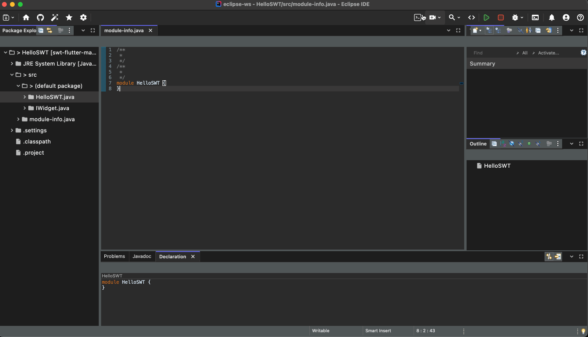

# SWT Evolve


  

[//]: # ([![GitHub stars]&#40;https://img.shields.io/github/stars/your-username/swt-evolve?style=social&#41;]&#40;https://github.com/equodev/swt-evolve/stargazers&#41;)

> **Modernize your SWT or Eclipse RCP application without changing a line of code. A new, cross-platform SWT library for desktop and web.**

SWT Evolve is a cross-platform drop-in replacement for the standard SWT library. It allows you to instantly upgrade your application's user interface to a modern, fluid, and beautiful standard, without rewriting your UI code.

---

## ✨ See it in Action

Words don't do it justice. Here is a standard Eclipse RCP application running with SWT Evolve.



### 🎨 SWT Evolve Widget Gallery

Check out the gallery of SWT snippets showing **SWT Evolve** implementations:  
👉 [**SWT Evolve Gallery**](https://equo.dev/swt-gallery)

This gallery provides small, focused SWT code snippets with rendered previews —  
a quick way to explore available widgets and see how they look in practice.

---

## 🚀 Getting Started: 2-Minute Modernization

You can try our examples or modernize your existing application in just a few minutes. Requirements: JDK 17+.

### Run the Examples

The easiest way to see SWT Evolve in action is to run the examples included in this repository.

1.  **Clone the repository:**
    ```bash
    git clone https://github.com/equodev/swt-evolve.git
    cd swt-evolve
    ```

2. **Run the examples you want:**
    ```bash
    ./gradlew runExample -PmainClass=dev.equo.StyledTextSnippet3
    ```
---

### Modernize Your Own App

1.  **Get SWT Evolve:** Clone this repository and build it (see [CONTRIBUTING.md](./CONTRIBUTING.md)), or get the `swt-evolve.jar` file from:
    - [Download latest release](https://github.com/equodev/swt-evolve/releases/latest)
2.  **Locate Your Old SWT Jar:** Find the original `swt.jar` in your SWT application.
3.  **Replace and Run:** Rename the swt-evolve JAR to match the exact filename of the original SWT JAR you located. Then, use your renamed file to replace the original. That's it—run your application to see the modernized UI.

Note: For the time being, this method only works for pure SWT applications. Support for Eclipse-based applications is coming soon.

## Key Features

* **✨ Instant Modernization:** No need for costly rewrites or code changes. If it runs on SWT, it runs on SWT Evolve.
* **💻 Truly Cross-Platform:** Develop once and deploy your application on Windows, macOS, Linux, and **in a web browser** from the same codebase.
* **🚀 GPU-Accelerated Performance:** Powered by a modern rendering engine, UIs are fluid, responsive, and efficient.
* **✒️ Pixel-Perfect Rendering:** Clean fonts, sharp icons, and beautiful widgets bring your application into the modern era.
* **🤝 100% API Compatible:** We are committed to implementing the complete SWT API for a seamless transition.
* **🔄 Seamless Fallback for Gradual Modernization:** Adopt at your own pace. SWT Evolve intelligently renders our modernized widgets and automatically falls back to the original SWT library for any widget we haven't implemented yet. Your application remains 100% functional, always.

---

## 📊 Project Status: Alpha

SWT Evolve is currently in an **alpha** stage. This means we are actively developing the core functionalities and implementing the API. We are already working with customers on commercial prototypes, but not all widgets are complete.

Here is the current status of major widgets:

| Widget            | Status                    | Notes                               |
|-------------------|---------------------------|-------------------------------------|
| `StyledText`      | ✔️ Implemented            |                                     |
| `Tree`            | ⚠️ Partially Implemented  | Key features working, more APIs to add. |
| `CTabFolder`      | ⚠️  Partially Implemented | Basic functionality is solid.       |
| `Button (Push)`   | ✔️ Implemented            |                                     |
| `Button (Check)`  | ✔️ Implemented            |                                     |
| `Button (Toggle)` | ✔️ Implemented            |                                     |
| `Button (Radio)`  | ⚠️ Partially Implemented  |                                     |
| `Button (Arrow)`  | ⚠️ Partially Implemented  |                                     |

---

## 🗺️ Roadmap

Our primary mission is the drive towards a stable `1.0` release. The vision for 1.0 is to provide a complete, modern, and high-performance replacement for the standard SWT library. **We are aiming to deliver this milestone, which includes full widget and API coverage, by the end of 2025.**

This is an ambitious goal, and our priorities are aggressively focused on making it a reality. The key workstreams are:

### Core API & Widget Completion
* [ ] Achieve 100% API coverage for all standard SWT widgets and layouts.
* [ ] Full support for graphical frameworks, including GEF, GMF, and Draw2D.

### Key Features & Milestones
* [ ] A fully modernized Eclipse IDE experience running flawlessly on SWT Evolve.
* [ ] Eliminate common UI freezes found in traditional SWT applications with our advanced threading model.

### Quality & Performance
* [ ] Continuous performance tuning and memory optimization.
* [ ] Comprehensive test suite coverage to ensure stability and compatibility.

This roadmap outlines our strategic goals. For a detailed, real-time view of our work-in-progress and upcoming tasks, please visit our **[Public Project Dashboard](https://github.com/orgs/equodev/projects/2/views/1)**.

---

## ❤️ How to Contribute

We are building SWT Evolve for the community and believe community contributions are the key to its success.

* **Report Bugs:** If you find an issue, please [report it](https://github.com/equodev/swt-evolve/issues).
* **Suggest Features:** Have a great idea? Let us know in the [Discussions tab](https://github.com/equodev/swt-evolve/discussions).
* **Write Code:** Check out our [CONTRIBUTING.md](./CONTRIBUTING.md) guide to get started. We have a list of issues [here](https://github.com/equodev/swt-evolve/issues).

---

## 📝 License

This project is licensed under the [Eclipse Public License 2.0](./LICENSE).

---

## 💼 Enterprise & Commercial Support

SWT Evolve is a free and open-source project, and we are committed to its growth and success.

For organizations requiring dedicated assistance, Equo Tech, Inc. offers professional services to accelerate your modernization journey and ensure your project's success. Our offerings include:

* **End-to-End Application Modernization:** Comprehensive services to migrate your legacy SWT/Eclipse RCP applications.
* **Custom Widget Development:** Bespoke UI components tailored to your specific business needs.
* **Theming & Custom Branding:** Full visual customization, including custom themes and branding, to align the application with your company's style guidelines.
* **Cloud Migration Strategy:** Expert guidance and implementation to bring your desktop applications to the cloud.
* **Dedicated Enterprise Support:** Priority support channels, training, and SLAs for mission-critical applications.

To learn more about how we can help your business succeed with SWT Evolve, please contact our team at **support@equo.dev**.
